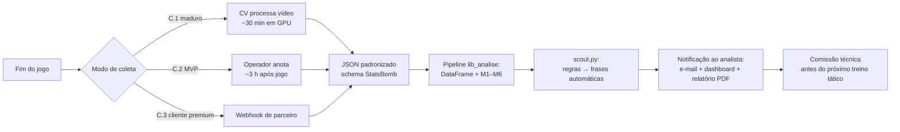

# Estratégia de Dados — DNA Tático

> Documento da **Frente C** do pitch. Responde diretamente ao ponto que o professor mais cobrou no áudio:
> *"não adianta falar 'nós vamos pegar dados do passado'. Isso serve pra treinar. Daqui pra frente, como é que eu vou pegar os dados pra realimentar? Vai ser pós-jogo? Se é pós-jogo, como que eu vou fazer?"*

---

## 1. A pergunta certa

A maioria das soluções de "analytics em futebol" começa pelo modelo. **Nós começamos pelo dado.** Antes de discutir métrica, é preciso responder três perguntas:

1. Como o sistema **aprende** o que é "joga pela direita" ou "pressiona alto"? — **Dados de treino**
2. Como o sistema **recebe novos jogos** depois de implantado? — **Dados de produção**
3. Quanto tempo leva entre o jogo terminar e o diagnóstico chegar na mão do treinador? — **SLA operacional**

A resposta a cada uma delas é uma escolha técnica E uma escolha de negócio.

---

## 2. C.0 — Dados de treino: StatsBomb Open Data

**O que é:** repositório público da [StatsBomb](https://github.com/statsbomb/open-data) com eventos anotados de centenas de partidas (La Liga, Premier League, Champions, Copas do Mundo, etc.).

**Por que usamos:**
- Anotação de alta qualidade — feita por analistas humanos profissionais.
- Schema documentado e estável.
- **Gratuito** com atribuição (licença + Media Pack).
- Cobre partidas históricas suficientes para **calibrar** todas as nossas regras e validar que o diagnóstico bate com a leitura tática conhecida (Barça posse, Atleti pressing, Liverpool transição...).

**Papel no produto:**
- **Bootstrap do modelo**: definir limiares das regras (M1–M6) e validar que o sistema reproduz consensos táticos conhecidos.
- **Demo no pitch**: rodar ao vivo na apresentação sem custo nem latência.
- **Conjunto de validação contínua**: cada nova versão do produto roda no Open Data antes de subir pra produção — se os Clásicos pararem de gerar a leitura certa, o build falha.

**Limitações desse dado para *produção*:**
- Cobertura desigual (alguns campeonatos têm 0 jogos, outros têm temporadas inteiras).
- Atraso na disponibilização (não é tempo real — chega meses depois).
- **Não cobre o mercado-alvo** (Série B/C/D brasileira, base, futebol feminino estadual, ligas amadoras).

→ Por isso o open data **serve pra treinar e demonstrar, não pra operar**. A operação precisa de outro caminho.

---

## 3. C.1 — Aposta principal: visão computacional sobre vídeo

**Tese:** quase todo clube do nosso mercado-alvo **já tem o vídeo** do próprio jogo e do adversário (transmissão estadual, câmera fixa do estádio, gravação do treinador). O que não tem é o **dado estruturado**. A nossa proposta é fechar esse gap.

### 3.1 Pipeline

```
Vídeo da partida (mp4, link de stream, gravação)
        ↓
Detecção e tracking de jogadores e bola
  (modelos abertos tipo YOLO + tracking; refs: SoccerNet, TrackNet, narya)
        ↓
Homografia: pixels da câmera → coordenadas (x, y) no campo 120×80
  (calibração automática a partir das linhas do campo)
        ↓
Classificação de eventos: passe, recepção, chute, recuperação, pressão
  (modelo treinado nas anotações StatsBomb — nosso "ouro")
        ↓
JSON com schema idêntico ao open data StatsBomb
        ↓
[entra no nosso pipeline já existente — lib_analise.py / scout.py]
        ↓
Diagnóstico tático automático
```

### 3.2 O que justifica essa aposta

| Argumento | Detalhe |
|---|---|
| **Tecnologia já existe em open source** | SoccerNet (datasets + baselines), TrackNet (tracking de bola), narya (homografia), modelos YOLO de detecção. Não estamos inventando CV de zero. |
| **Custo unitário tende a zero** | Custo é dominante em infra (GPU/CPU em batch). Cada novo jogo processado é centavos em compute. |
| **Diferencial competitivo defensável** | Wyscout não vai pra Série C porque o operacional dele (scouts humanos) não escala. Nós escalamos via software. |
| **Barreira de entrada técnica** | Não é trivial de copiar — requer dataset anotado (que temos via StatsBomb pra treinar) + engenharia de pipeline. |

### 3.3 Riscos e mitigações

| Risco | Mitigação |
|---|---|
| Qualidade do CV inferior à anotação humana no início | Lançar com C.2 (anotação assistida) e usar CV pra acelerar o operador. CV puro é V2/V3. |
| Câmera ruim do clube cliente (resolução baixa, ângulo lateral) | Calibração automática + degradação graciosa: se não dá pra trackear bola, ainda dá pra heatmap de posição. |
| Eventos sutis (pressão, intenção) difíceis de classificar | Não tentamos classificar tudo. M1–M6 dependem de eventos "robustos" (passe, chute, recuperação) — os difíceis (Pressure subjetivo) podem ficar de fora na V1. |

### 3.4 Status no Grau B
**Apresentamos como roadmap, não implementamos.** O pitch mostra um diagrama do pipeline e uma POC de ingestão de JSON externo (qualquer sistema que cuspir o schema StatsBomb entra direto no nosso código). Argumento defendido com referências de tecnologia existente.

---

## 4. C.2 — Bridge: anotação humana assistida

**Tese:** para sair pra mercado **antes** do CV maduro, precisamos de um caminho operacional que use humano. Mas humano puro é caro — então é **humano assistido pela máquina**.

### 4.1 Como funciona

- **Operador (analista júnior ou estagiário)** assiste ao vídeo do jogo num player web nosso.
- Ao apertar atalhos de teclado (`P` = passe, `R` = recuperação, `C` = chute, ...) **e clicar no ponto do campo**, o evento é registrado.
- O sistema completa o resto automaticamente: time do operador, jogador (com ML auxiliar), coordenadas, timestamp.
- Ao final do jogo, sai o mesmo JSON que o C.1 produziria — e o resto do pipeline é idêntico.

### 4.2 Custos

- **Tempo de anotação**: ~1,5x a 2x a duração do jogo no início (3h pra um jogo de 90min). Reduzir pra 1x com auto-completar agressivo.
- **Custo direto**: ~R$ 30–60 por jogo (estagiário/freelancer). Para um clube acompanhando 5 adversários por mês, R$ 150–300/mês — **dentro do tier pago**.

### 4.3 Função estratégica

1. **Time-to-market**: começamos a vender enquanto o C.1 amadurece.
2. **Geração de dataset proprietário**: cada jogo anotado vira input pra treinar o CV.
3. **Backstop de qualidade**: mesmo depois do C.1 pronto, casos difíceis caem pro operador humano (graceful degradation).

---

## 5. C.3 — Crescimento futuro: parceria/licenciamento

**Quando faz sentido:**
- Cliente premium quer dado já anotado (Wyscout/StatsBomb-grade) sem esperar pipeline próprio rodar.
- Time profissional que **já paga** Wyscout e quer somar nossa camada de **interpretação** em cima.

**Modelo:**
- Conectores plug-and-play com Wyscout API, StatsBomb Pro, Stats Perform.
- Nosso valor agregado é a **interpretação automática** — eles trazem o dado, nós traduzimos pro treinador.

**Por que não como entrada principal:**
- Custo de assinatura (R$ 100k–500k/ano) inviabiliza o mercado-alvo.
- Vira commodity de input — qualquer concorrente pode comprar igual.

---

## 6. Pipeline pós-jogo (operação real)



### SLA defendido no pitch

| Modo | Tempo do fim do jogo até diagnóstico disponível |
|---|---|
| C.1 (CV) | < 1 hora |
| C.2 (anotação assistida) | 4–6 horas |
| C.3 (parceria) | depende do SLA do parceiro, tipicamente 24h |

**Meta de produto:** *"Análise do adversário pronta antes da reunião técnica de segunda-feira."*

---

## 7. Plano de rollout

| Fase | Quando | Coleta principal | Clientes alvo | Métrica de sucesso |
|---|---|---|---|---|
| **Fase 0 — Demo** | Hoje (pitch) | StatsBomb Open Data | — | Funciona ao vivo |
| **Fase 1 — Piloto** | 0–6 meses pós-pitch | C.2 (anotação assistida) com 1 operador | 2–3 clubes piloto (Série B/C ou base) | NPS ≥ 50, 80% retenção |
| **Fase 2 — Escala** | 6–18 meses | C.2 + C.1 v1 (CV cobrindo passes + chutes) | 10–20 clubes | ARR ≥ R$ 200k/ano |
| **Fase 3 — Maturidade** | 18–36 meses | C.1 v2 (CV cobrindo todos eventos) + C.3 conectores premium | 50+ clubes + clientes premium | ARR ≥ R$ 1M/ano |

---

## 8. O que dizer no pitch (resumo de 60 segundos)

> "A pergunta que o investidor sempre faz é: **'de onde vem o dado depois?'** Nossa resposta tem três camadas. Hoje, pra treinar e demonstrar, usamos o StatsBomb Open Data — gratuito, alta qualidade. Pra **operar com clientes desde o dia um**, usamos anotação humana assistida — um estagiário, 3 horas por jogo, R$ 50 por jogo. Pra **escalar pra 50+ clubes**, estamos construindo um pipeline de visão computacional que extrai eventos direto do vídeo da partida — porque 99% dos clubes brasileiros têm vídeo, mas não têm dado anotado. Esse é o gap que nos diferencia da Wyscout: eles vendem dado pra quem pode pagar R$ 200 mil; nós entregamos diagnóstico pra quem só tem o vídeo do jogo do final de semana."

---

## 9. Limitações honestas (slide de backup pra Q&A)

- **Não capturamos o que não é evento**: posicionamento defensivo de jogador sem bola, intenção tática do treinador, mudança de marcação no intervalo.
- **CV ainda não pronto** — Fase 2 em diante depende de execução técnica bem-sucedida.
- **Qualidade do vídeo do cliente** é variável; alguns casos vão precisar de C.2 indefinidamente.
- **Anotação humana introduz subjetividade** — calibração contínua entre operadores é necessária.
- **Dependência da StatsBomb pra treino** — se o open data sair do ar, precisamos de outra fonte de calibração.
