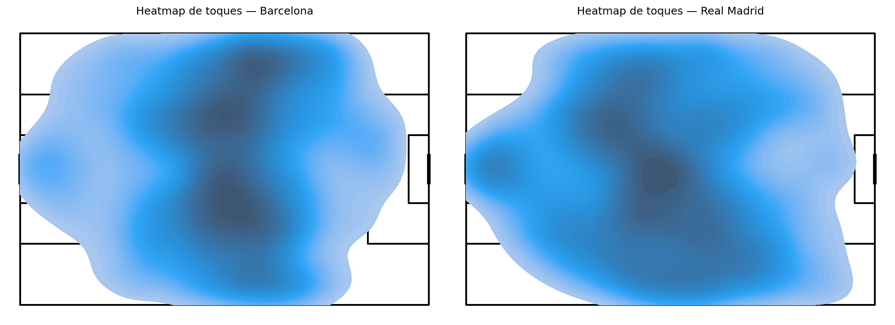
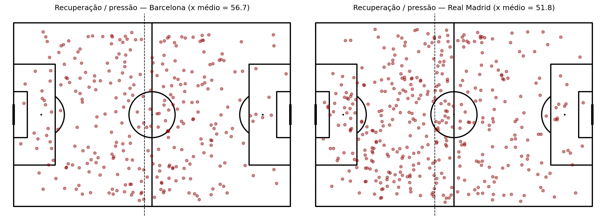
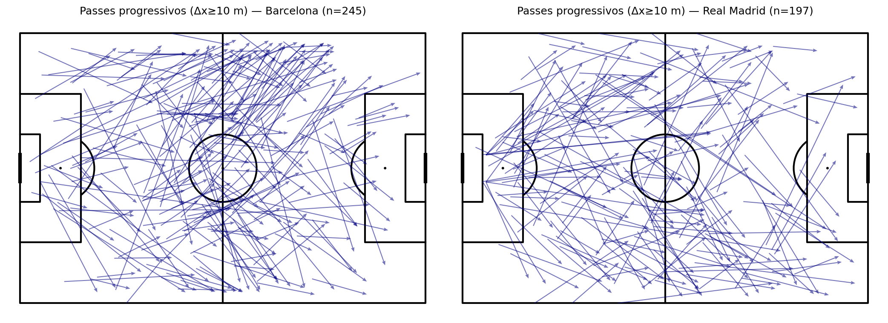
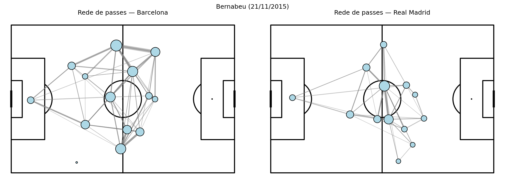
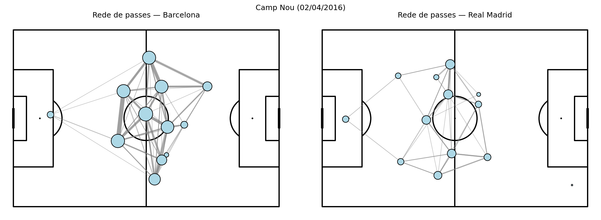
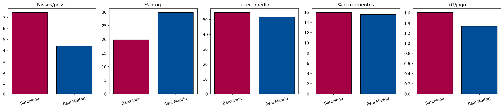

\newpage

## Capa e identificação

- **Disciplina:** computação aplicada ao futebol — Unisinos / Escola Politécnica  
- **Tema:** análise de estilo tático (DNA tático) com eventos de partida  
- **Pergunta de pesquisa:** como identificar automaticamente o estilo de jogo de um time?  
- **Fonte de dados:** [StatsBomb Open Data](https://github.com/statsbomb/open-data) (dados públicos de eventos).  
- **Atribuição:** dados e marca conforme licença e *Media Pack* da StatsBomb ao publicar análises.

**Competição e jogos analisados**

| Campo | Valor |
|-------|--------|
| Competição | La Liga — temporada **2015/2016** |
| IDs | `competition_id=11`, `season_id=27` |
| Partida 1 | `match_id=266424` — 21/11/2015 — **Real Madrid 0 × 4 Barcelona** (Bernabéu) |
| Partida 2 | `match_id=267533` — 02/04/2016 — **Barcelona 1 × 2 Real Madrid** (Camp Nou) |

**Justificativa do recorte:** dois adversários de perfil tático contrastante e reconhecível globalmente; dois confrontos na mesma temporada (cada time uma vez como mandante), permitindo comparar DNA agregado sem inflar o escopo.

---

# Parte 1 — Aplicação dos conceitos fundamentais

## 1.1 Modelagem de dados

**Entidades principais**

1. **Competição / temporada** — metadados em `competitions.json` e pasta `matches/<competition_id>/<season_id>.json`.  
2. **Partida** — identificador `match_id`, mandante, visitante, placar (arquivo de partidas).  
3. **Time** — `team` (nome) e identificador implícito nos eventos.  
4. **Jogador** — `player` e `position` quando o evento é associado a um jogador.  
5. **Evento** — unidade atômica da análise: `id`, `index`, `period`, `minute`/`second`, `type` (Pass, Shot, Pressure, …), localização `(x, y)`, subestruturas `pass`, `shot`, etc.

**Estrutura de armazenamento**

- **Fonte:** JSON linha a linha conforme exportação StatsBomb (`events/<match_id>.json`).  
- **Transformação aplicada:** projeção para **DataFrame** tabular (uma linha por evento), implementada em `analise/lib_analise.py` (`load_events`, `load_all`). Colunas planas facilitam agregação em SQL-like (`groupby`) e visualização.

**Atributos relevantes no DataFrame**

| Coluna | Tipo (lógico) | Uso |
|--------|----------------|-----|
| `match_id` | inteiro | Junção com metadados de partida |
| `minute`, `second` | inteiro | Tempo de jogo |
| `type` | texto | Filtrar passes, chutes, pressões |
| `team` | texto | Agregar por Barcelona / Real Madrid |
| `x`, `y` | float | Mapas e heatmaps (campo 120×80) |
| `possession`, `possession_team` | int / texto | Sequências de posse (M1) |
| `pass_end_x`, `pass_end_y`, `pass_cross`, `pass_outcome` | float / bool / texto | Progressão e cruzamentos (M2, M4) |
| `shot_xg`, `shot_outcome` | float / texto | Ameaça (M6) |

---

## 1.2 Métricas de desempenho (DNA tático)

Todas as métricas foram calculadas sobre a **união dos dois jogos**, agregadas por `team`, salvas em `figuras/tabela_dna.csv` e reproduzidas no notebook `analise/analise_dna_tatico.ipynb`.

### M1 — Construção de jogo (posse)

- **Definição:** agrupar eventos por `(match_id, possession, possession_team)`; contar passes na posse; duração aproximada = diferença entre `minute` máximo e mínimo na posse; média de passes por posse e fração de posses com ≥5 passes.  
- **Interpretação:** mais passes por posse e posses longas frequentes indicam **construção elaborada**; valores menores sugerem **transição / jogo mais direto**.

**Resultado (resumo):** Barcelona apresenta **média de passes por posse maior** (~7,45 vs ~4,37) e **duração média da posse** maior (~0,40 vs ~0,25 min aproximados), alinhado a um perfil de circulação e retenção. O Real Madrid troca de posse com menos passes por sequência.

### M2 — Progressão no campo

- **Definição:** passes completos (`pass_outcome` nulo); $\Delta x = \texttt{pass\_end\_x} - \texttt{x}$; avanço médio; **passes progressivos** = $\Delta x \geq 10$ m.  
- **Interpretação:** maior avanço médio e maior % de progressivos indicam **verticalização**; avanço médio menor com muitos passes pode indicar **circulação** para desestabilizar bloco.

**Resultado:** o Real Madrid apresenta **avanço médio maior** (~4,35 m vs ~1,83 m) e **% maior de passes progressivos** (~29,8% vs ~19,8%), sugerindo jogo mais direto na amostra; o Barcelona completa mais passes totais com avanço médio menor (circulação + construção).

### M3 — Lateralização (terço de ataque)

- **Definição:** eventos com $x \in [80,120]$; lado **esquerdo** do ataque se $y \geq 40$, senão **direito** (convenção StatsBomb).  
- **Interpretação:** desequilíbrio entre `pct_esq` e `pct_dir` indica **viés de corredor** no terço final.

**Resultado:** Barcelona concentra ~60% dos eventos ofensivos no **lado direito** do ataque ($y<40$); o Real Madrid está mais **pela esquerda** (~55%). Útil para scouting de sobrecarga e combinações.

### M4 — Infiltração vs cruzamento (entrada na área)

- **Definição:** passes completos com `pass_end_x ≥ 102` (aproximação da grande área); `cruzamentos` = flag `pass_cross`; `pct_cruzamentos` = cruzamentos / total de passes para a área.  
- **Interpretação:** maior % de cruzamentos indica finalização **pelas linhas de fundo**; menor % sugere mais **jogo pelo meio / infiltração**.

**Resultado:** ambos com **% de cruzamentos similar** (~15,6–15,9%) sobre o total de passes que entram na área — diferença tática maior aparece em M2/M3/M5.

### M5 — Altura de recuperação / pressão (proxy de bloco)

- **Definição:** média de `x` em eventos `Ball Recovery`, `Pressure`, `Interception`, `Duel`; contagem de `Pressure`.  
- **Interpretação:** **x médio mais alto** → recuperações/pressões mais adiantadas (**linha mais alta**), proxy de pressão ou bloco adiantado.

**Resultado:** Barcelona com **x médio maior** (~54,6 vs ~51,6) e **menos** eventos de pressão que o Real na amostra (194 vs 315) — leitura conjunta: quando pressiona/recupera, tende a fazê-lo um pouco mais alto; o Real gera mais volume de pressão registrada.

### M6 — Ameaça (finalização)

- **Definição:** por jogo e por time: contagem de chutes; soma de `statsbomb_xg`; gols totais nos dois jogos.  
- **Interpretação:** xG e chutes por jogo medem **volume e qualidade** da finalização.

**Resultado:** Barcelona ~**16 chutes/jogo** e ~**1,60 xG/jogo** com **5 gols** nos dois jogos; Real Madrid ~**14 chutes/jogo** e ~**1,33 xG/jogo** com **2 gols**. Coerente com o placar agregado da amostra (5–2 em gols).

---

## 1.3 Qualidade dos dados e limitações

1. **Codificação humana:** eventos são anotados por analistas; há subjetividade (ex.: fronteira entre `Pressure` e duelo).  
2. **Completude:** nem todo micro-movimento vira evento; sequências rápidas podem ser simplificadas.  
3. **Posse:** usamos o identificador `possession` da StatsBomb como **proxy** operacional; não substitui tracking óptico.  
4. **Sem tracking contínuo:** não há posição de todos os jogadores a cada instante — só eventos discretos (e 360 só em subset de jogos, não usado aqui).  
5. **Contexto ausente:** clima, ordens táticas no intervalo, estado físico, cartões acumulados, importância da tabela — não estão no JSON.  
6. **Amostra pequena:** **dois jogos** entre os mesmos times; o DNA é **indicativo daquele confronto/temporada**, não uma verdade eterna sobre os clubes.

**Impacto na análise:** as métricas descrevem **padrões registrados** na amostra; generalizações para outras competições ou anos exigem mais dados e validação externa (vídeo, tracking).

---

## 1.4 Visualização de dados

As figuras foram geradas com `mplsoccer` (campo tipo StatsBomb) e `matplotlib`, salvas em `figuras/` (script `analise/run_gerar_figuras.py`).



*Figura 1 — Densidade de eventos com coordenadas (`x`,`y`) por time: onde cada equipe “vive” no campo.*



*Figura 2 — Dispersão de recuperação / interceptação / pressão; linha tracejada no x médio (proxy de altura média).*



*Figura 3 — Setas de passes com Δx ≥ 10 m (progressivos).*



*Figura 4a — Rede de passes (≥3 ligações entre o mesmo par); jogo 266424.*



*Figura 4b — Mesmo modelo para o jogo 267533.*



*Figura 5 — Barras comparativas: passes/posse, % passes progressivos, x médio de recuperação, % cruzamentos na área, xG/jogo.*

**Padrões visíveis:** mapas evidenciam **ocupação de espaço**; redes mostram **eixos de circulação** (hubs); barras sintetizam o **DNA numérico** para o relatório e para o *dashboard* proposto na Parte 2.

---

\newpage

# Parte 2 — Proposta de sistema no futebol

## 2.1 Definição do problema e relevância

**Problema:** comissões técnicas e analistas precisam **resumir o estilo do adversário** (construção vs transição, corredores preferidos, altura de pressão, finalização) com base em dados objetivos, em tempo hábil para a semana de jogo.

**Relevância:** reduz dependência só de impressão subjetiva; apoia **decisão** sobre pressing, compactação, e marcação de corredores; comunica padrões a jogadores via visualizações simples.

## 2.2 Dados e modelagem no sistema

- **Entrada:** arquivos `events/*.json` + `matches/*.json` (metadados) da pasta local ou API futura.  
- **Pipeline:** ingestão JSON → DataFrame de eventos (`lib_analise`) → agregações M1–M6 → tabela `dna` → exportação de PNG/PDF.  
- **Persistência (evolução):** opcional SQLite/Parquet para histórico multi-partida.

## 2.3 Métricas e análises automatizadas

O sistema rotula automaticamente, por time e janela de jogos:

1. Construção (M1)  
2. Verticalidade (M2)  
3. Lateralização ofensiva (M3)  
4. Entrada na área por cruzamento (M4)  
5. Altura de recuperação / intensidade de pressão (M5)  
6. Ameaça de finalização (M6)

Saída: **perfil comparativo** (Barcelona vs Real Madrid na demo) + alertas textuais gerados por regras (ex.: se `pct_progressivos` > 25% e `media_passes_por_posse` < 5 → tag sugerida “Transição vertical”).

## 2.4 Coleta e qualidade dos dados

- **Coleta:** download do repositório público StatsBomb; atualização manual ao puxar novas versões do GitHub.  
- **Qualidade:** conforme seção 1.3; o sistema deve exibir **disclaimer** e tamanho da amostra (N jogos).

## 2.5 Limitações e desafios do sistema

- Não infere **intenção** do treinador nem lê **princípios** táticos não observáveis nos eventos.  
- **Viés de resultado:** um clássico 0–4 pode alterar ritmo e risco; ideal agregar mais jogos.  
- **Manutenção:** versões do schema de eventos (PDF *Open Data Events*) podem mudar nomes/campos.

## 2.6 Visualização e apresentação (dashboard)

**Wireframe textual (tela única “Adversário”):**

1. Cabeçalho: adversário, últimos N jogos, competição.  
2. Painel esquerdo: **Figura 5** (barras DNA) + tabela numérica.  
3. Painel central: **Figura 1** + **Figura 3** (mapa + progressivos).  
4. Painel direito: **Figura 2** + **Figura 4** (rede + recuperação).  
5. Rodapé: texto gerado (“alto volume de passes por posse”, “favorece corredor X”, etc.).

**Usuário final:** analista de performance ou auxiliar técnico — prioriza **comparabilidade** e **leitura rápida** antes do vídeo tático.

---

\newpage

# Parte 3 — Integração e evolução

## 3.1 Integração dos conceitos da disciplina

```text
Modelagem (entidade Evento + DataFrame)
        ↓
Métricas (M1–M6 — proxies de estilo)
        ↓
Visualização (mapas, redes, barras)
        ↓
Interpretação / decisão (preparação de jogo)
```

A **modelagem** garante que cada métrica tenha **rastreabilidade** até o evento bruto; as **métricas** comprimem milhares de linhas em poucos números interpretáveis; as **visualizações** devolvem **contexto espacial** que números sozinhos escondem.

## 3.2 Evolução ao longo da disciplina

Exemplos do que pode ser narrado (ajuste às aulas reais):

- Início: leitura manual de JSON e contagens simples de passes.  
- Evolução: definição formal de **posse** via `possession`, **passes progressivos** com limiar em metros, e **normalização** por jogo.  
- Próximos passos: incluir **xThreat** ou redes de posse, agregar **10+ jogos**, exportar **API** interna, ou integrar **lineups** para contexto de formação.

## 3.3 Reflexão final

| | Análise inicial (conceitual) | Sistema proposto |
|---|------------------------------|------------------|
| Dados | Eventos soltos | Pipeline + DataFrame versionado |
| Métricas | Contagem genérica | 6 proxies alinhados a leitura tática |
| Visual | Ideia genérica de “mapa” | 5 figuras padronizadas + dashboard |
| Decisão | Interpretação ad hoc | Painel comparativo replicável |

**O que se manteve:** foco em **eventos com coordenadas** e na pergunta sobre **estilo**.  
**O que evoluiu:** formalização M1–M6, script reprodutível, e proposta de produto para **análise de adversário**.

---

## Conclusão

Na amostra (dois Clásicos 2015/16), o **Barcelona** apresenta DNA de **maior passes por posse**, **maior duração de posse**, **maior concentração pelo corredor direito no terço de ataque** e **maior xG e gols**; o **Real Madrid** aparece com **jogo mais vertical** (maior avanço médio e % de passes progressivos), **mais ações de pressão registradas** e **recuperação média um pouco mais baixa** no conjunto M5 — leitura sempre condicionada ao n=2 jogos e ao contexto histórico da temporada.

---

## Referências e atribuição

- StatsBomb Open Data: [https://github.com/statsbomb/open-data](https://github.com/statsbomb/open-data)  
- Documentação de eventos: PDF *Open Data Events* no repositório (`doc/`).  
- **Uso dos dados:** citar **StatsBomb** e observar **Media Pack** / licença ao divulgar trabalhos públicos.

**Repositório de código deste trabalho:** pasta `analise/` (notebook + `lib_analise.py` + `run_gerar_figuras.py`), `figuras/` (saídas), `relatorio/` (este documento).
